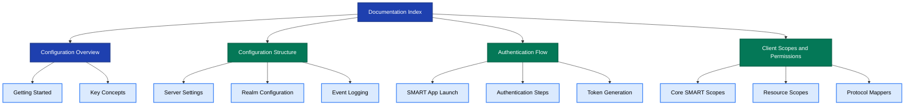

# Documentation Index

## Keycloak Configuration for FHIR

This documentation explains the Keycloak configuration system for implementing SMART on FHIR authentication and authorization.

## Documentation Structure

**Figure 1:** Documentation structure and navigation guide.

## Core Documentation

### 1. Configuration Overview

**File**: [keycloak-config-overview.md](./keycloak-config-overview.md)

**Topics Covered**:

- High-level purpose and goals
- Target audience
- Key concepts introduction
- Architecture overview
- Quick reference guide

**Start Here**: Best for first-time readers and those needing a general understanding.

### 2. Configuration Structure

**File**: [keycloak-config-structure.md](./keycloak-config-structure.md)

**Topics Covered**:

- Complete JSON structure breakdown
- Server connection settings
- Realm configuration properties
- Client scope definitions
- Client application settings
- Authentication flow structure
- Groups and events configuration

**Use When**: You need detailed information about specific configuration sections.

### 3. Authentication Flow

**File**: [keycloak-auth-flow.md](./keycloak-auth-flow.md)

**Topics Covered**:

- SMART App Launch implementation
- Authentication sequence diagrams
- Audience validation process
- Username/password authentication
- Patient selection mechanism
- Token generation and claims
- Error handling
- Security considerations

**Use When**: Implementing or troubleshooting authentication flows.

### 4. Client Scopes and Permissions

**File**: [keycloak-scopes.md](./keycloak-scopes.md)

**Topics Covered**:

- Scope architecture
- Core SMART scopes (fhirUser, launch/patient, online_access)
- Wildcard scope (patient/*.read)
- 25+ granular resource scopes
- Protocol mappers and token claims
- Scope assignment strategies
- Best practices for scope selection

**Use When**: Configuring permissions or implementing scope-based authorization.

### 5. HAPI FHIR Integration

**File**: [hapi-fhir-integration.md](./hapi-fhir-integration.md)

**Topics Covered**:

- Integration architecture
- Token validation interceptors
- Scope-based authorization in HAPI FHIR
- Patient context filtering
- Complete request flow
- Server configuration
- Implementation examples
- Testing strategies
- Deployment architecture
- Troubleshooting guide

**Use When**: Integrating Keycloak with a HAPI FHIR server or implementing authorization logic.

### 6. HAPI FHIR Starter Integration

**File**: [hapi-fhir-starter-integration.md](./hapi-fhir-starter-integration.md)

**Topics Covered**:

- Built-in authorization capabilities in HAPI FHIR Starter
- How scopes in tokens become permissions automatically
- Complete token-to-permission flow
- Minimal configuration setup (10 lines of YAML)
- Practical examples with different scope combinations
- Wildcard scope usage
- Troubleshooting common issues
- Zero custom code solution

**Use When**: Setting up a new HAPI FHIR server with built-in authorization or want to understand automatic scope enforcement.

## Quick Navigation

### By Role

#### For Developers

1. [Configuration Overview](./keycloak-config-overview.md) - Understand the system
2. [Client Scopes](./keycloak-scopes.md) - Learn about permissions
3. [Authentication Flow](./keycloak-auth-flow.md) - Implement login flows
4. [HAPI FHIR Starter Integration](./hapi-fhir-starter-integration.md) - Quick setup guide
5. [HAPI FHIR Integration](./hapi-fhir-integration.md) - Advanced customization

#### For DevOps Engineers

1. [Configuration Structure](./keycloak-config-structure.md) - Deployment settings
2. [Authentication Flow](./keycloak-auth-flow.md) - System behavior
3. [HAPI FHIR Starter Integration](./hapi-fhir-starter-integration.md) - Server setup
4. [HAPI FHIR Integration](./hapi-fhir-integration.md) - Server configuration
5. [Configuration Overview](./keycloak-config-overview.md) - Architecture

#### For Security Architects

1. [Authentication Flow](./keycloak-auth-flow.md) - Security controls
2. [Client Scopes](./keycloak-scopes.md) - Permission model
3. [HAPI FHIR Integration](./hapi-fhir-integration.md) - Token validation
4. [Configuration Structure](./keycloak-config-structure.md) - Audit configuration

#### For QA Engineers

1. [Configuration Overview](./keycloak-config-overview.md) - System understanding
2. [Authentication Flow](./keycloak-auth-flow.md) - Test scenarios
3. [Client Scopes](./keycloak-scopes.md) - Permission testing
4. [HAPI FHIR Integration](./hapi-fhir-integration.md) - Integration testing

### By Task

#### Setting Up Keycloak

1. Review [Server Connection Settings](./keycloak-config-structure.md#server-connection-settings)
2. Understand [Realm Configuration](./keycloak-config-structure.md#realm-configuration)
3. Configure [Client Applications](./keycloak-config-structure.md#clients-section)

#### Implementing SMART App Launch

1. Read [SMART App Launch Overview](./keycloak-auth-flow.md#overview)
2. Configure [Authentication Flow](./keycloak-auth-flow.md#flow-configuration)
3. Set up [Patient Selection](./keycloak-auth-flow.md#step-3-patient-selection)

#### Managing Permissions

1. Understand [Scope Architecture](./keycloak-scopes.md#scope-architecture)
2. Configure [Default and Optional Scopes](./keycloak-scopes.md#scope-assignment-to-clients)
3. Review [Best Practices](./keycloak-scopes.md#best-practices)

#### Troubleshooting

1. Check [Error Handling](./keycloak-auth-flow.md#error-handling)
2. Review [Event Logging](./keycloak-config-structure.md#events-configuration)
3. Validate [Token Claims](./keycloak-scopes.md#token-claim-mapping-summary)
4. Debug [HAPI FHIR Integration Issues](./hapi-fhir-integration.md#troubleshooting-guide)

#### Deploying to Production

1. Review [HAPI FHIR Deployment Architecture](./hapi-fhir-integration.md#deployment-architecture)
2. Configure [Security Best Practices](./hapi-fhir-integration.md#security-best-practices)
3. Set up [Performance Optimization](./hapi-fhir-integration.md#performance-considerations)
4. Implement [Monitoring and Logging](./hapi-fhir-integration.md#security-best-practices)

## Related Resources

### External Documentation

- [SMART App Launch Framework](http://hl7.org/fhir/smart-app-launch/) - Official specification
- [HAPI FHIR Documentation](https://hapifhir.io/hapi-fhir/docs/) - HAPI FHIR server reference
- [Keycloak Documentation](https://www.keycloak.org/documentation) - Keycloak reference
- [FHIR Specification](https://www.hl7.org/fhir/) - HL7 FHIR standard
- [OAuth 2.0 RFC](https://tools.ietf.org/html/rfc6749) - OAuth 2.0 specification
- [OpenID Connect](https://openid.net/connect/) - OIDC specification

### Project Resources

- **Source Code**: `keycloak-config/src/main/java/org/alvearie/keycloak/config/`
- **Configuration Files**: `keycloak-config/src/test/resources/keycloak-config.json`
- **Extensions**: `keycloak-extensions/src/main/java/org/alvearie/keycloak/`
- **Templates**: `keycloak-extensions/src/main/resources/theme-resources/templates/`

## Glossary

| Term                | Definition                                                     |
| ------------------- | -------------------------------------------------------------- |
| **SMART on FHIR**   | Standard for healthcare app authorization with patient context |
| **Realm**           | Isolated configuration space in Keycloak (like a tenant)       |
| **Client Scope**    | OAuth 2.0 scope defining permissions and token claims          |
| **Client**          | Application that authenticates through Keycloak                |
| **Protocol Mapper** | Component that adds claims to tokens                           |
| **Authenticator**   | Component that performs authentication logic                   |
| **Patient Context** | Association of authorization with a specific patient           |
| **Audience Claim**  | Token claim identifying the intended recipient (FHIR server)   |
| **Access Token**    | Short-lived token for API access                               |
| **Refresh Token**   | Long-lived token to obtain new access tokens                   |
| **ID Token**        | Token containing user identity information                     |

## Version Information

- **Keycloak Version**: Compatible with Keycloak 10.x and later
- **FHIR Version**: Supports FHIR R4
- **SMART Version**: Implements SMART App Launch 1.0.0

## Contributing

To update this documentation:

1. Follow the visualization guidance in each document
2. Use Mermaid diagrams for complex concepts
3. Maintain consistent formatting and structure
4. Test all diagrams before committing
5. Update the index when adding new documents

## Support

For questions or issues:

- **GitHub Issues**: [Project Issues](https://github.com/Alvearie/keycloak-extensions-for-fhir/issues)
- **Documentation**: This directory
- **Code Examples**: See test resources and integration tests

## Change Log

| Date       | Document | Changes                                              |
| ---------- | -------- | ---------------------------------------------------- |
| 2025-11-06 | All      | Initial documentation creation with Mermaid diagrams |

## Next Steps

Choose your starting point based on your role:

- **New to the project?** → Start with [Configuration Overview](./keycloak-config-overview.md)
- **Need implementation details?** → Jump to [Configuration Structure](./keycloak-config-structure.md)
- **Working on authentication?** → Review [Authentication Flow](./keycloak-auth-flow.md)
- **Managing permissions?** → Explore [Client Scopes](./keycloak-scopes.md)
