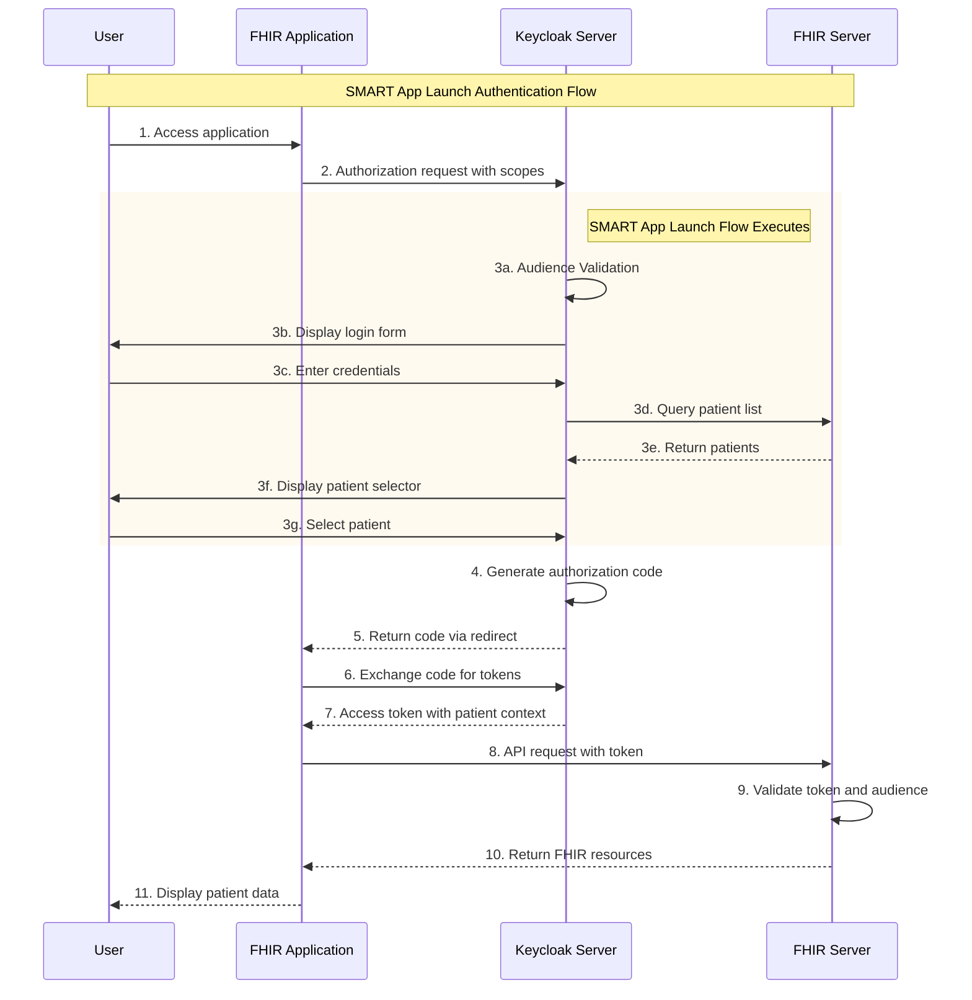
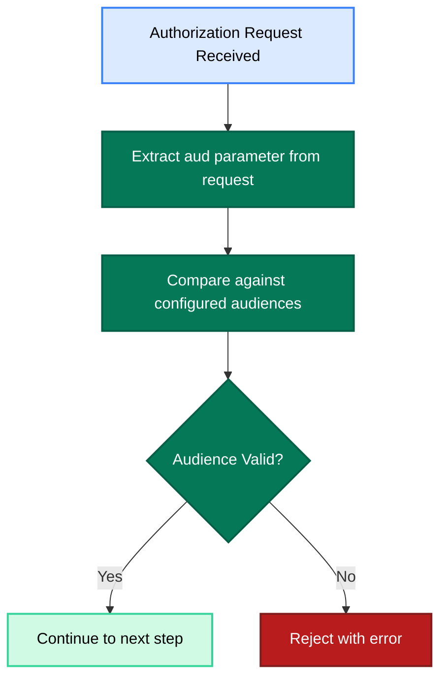
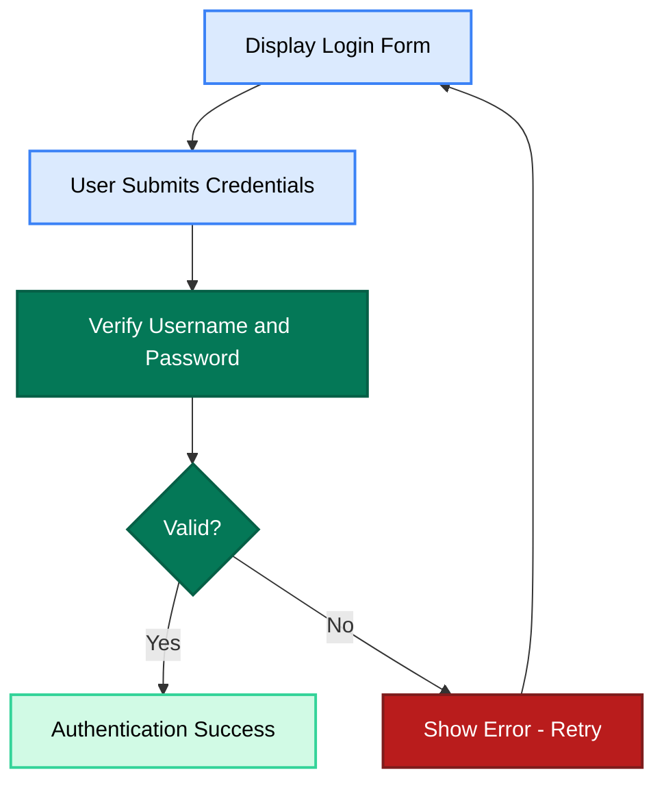
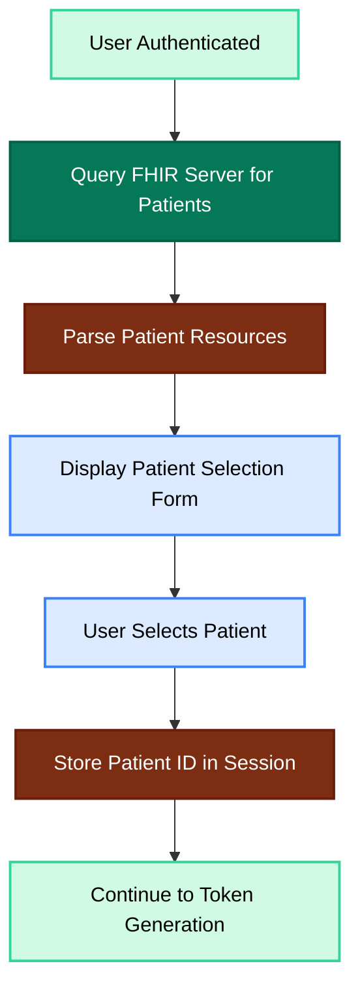
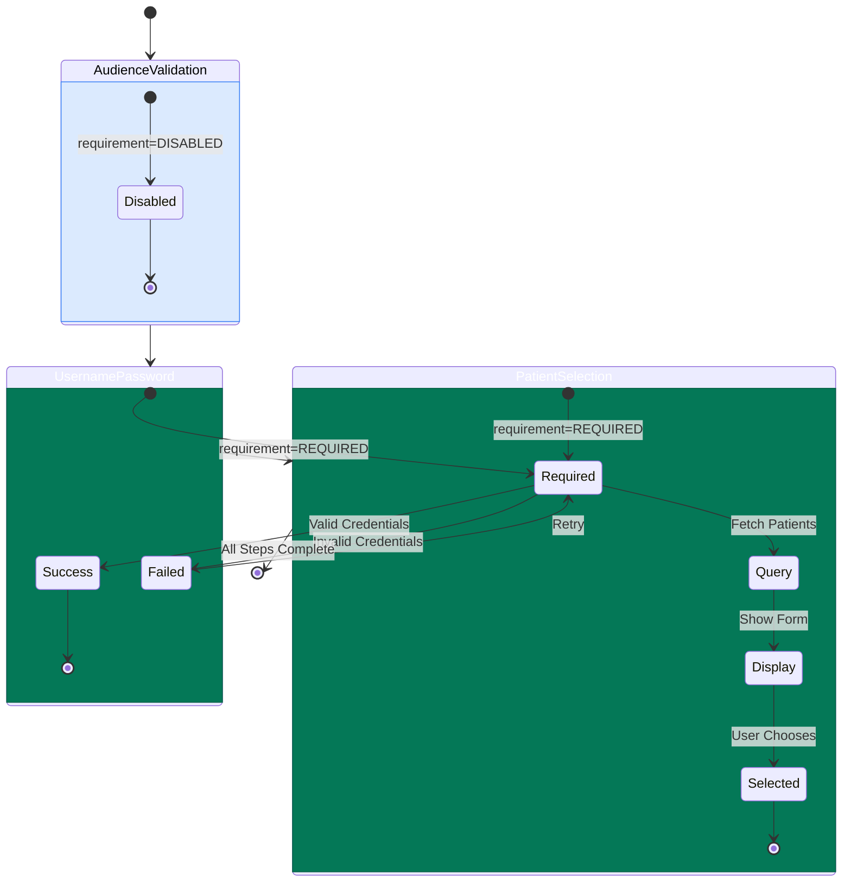
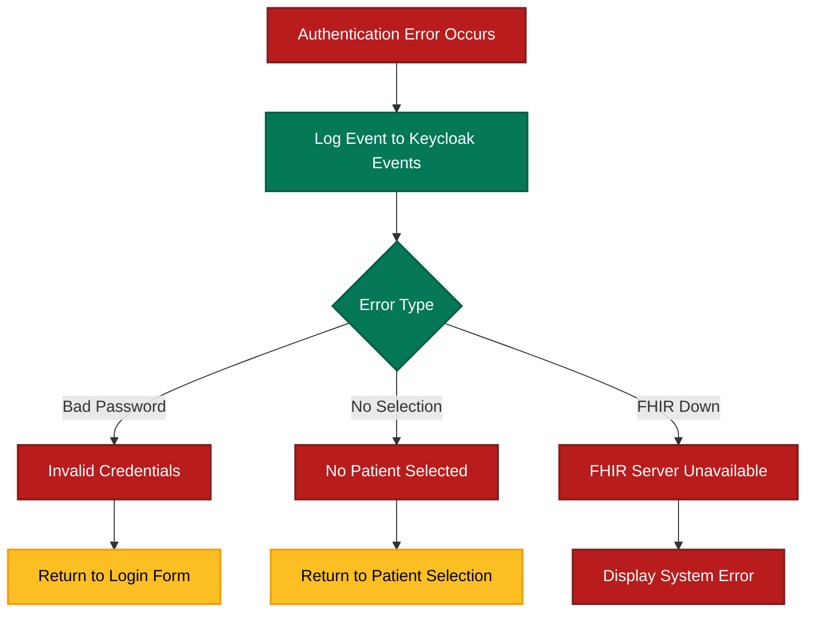

# SMART App Launch Authentication Flow

## Overview

This document explains the SMART App Launch authentication flow implemented in the Keycloak configuration. SMART (Substitutable Medical Applications, Reusable Technologies) is the healthcare standard for secure application authorization with patient context.

## Authentication Flow Sequence



**Figure 1:** Complete SMART App Launch authentication sequence showing all actors and their interactions.

## Flow Configuration

The authentication flow is defined in the `authenticationFlows` section and set as the `browserFlow` for the realm.

```json
{
  "SMART App Launch": {
    "description": "browser based authentication",
    "providerId": "basic-flow",
    "builtIn": false,
    "authenticationExecutions": {
      "SMART Login": { ... }
    }
  },
  "browserFlow": "SMART App Launch"
}
```

## Execution Steps

### Step 1: Audience Validation



**Figure 2:** Audience validation process flow.

#### Audience Validator Configuration

```json
{
  "Audience Validation": {
    "authenticator": "audience-validator",
    "requirement": "DISABLED",
    "priority": 10,
    "authenticatorFlow": false,
    "configAlias": "localhost",
    "config": {
      "audiences": "https://localhost:9443/fhir-server/api/v4##http://host.docker.internal:9080/fhir-server/api/v4"
    }
  }
}
```

#### Audience Validator Key Points

- **Authenticator**: `audience-validator` (custom component)
- **Requirement**: `DISABLED` in test config (can be enabled for production)
- **Purpose**: Validates that the requested FHIR server URL is authorized
- **Audiences**: Multiple URLs separated by `##`

### Step 2: Username and Password Authentication



**Figure 3:** Standard username/password authentication flow.

#### Username Password Configuration

```json
{
  "Username Password Form": {
    "authenticator": "auth-username-password-form",
    "requirement": "REQUIRED",
    "priority": 20,
    "authenticatorFlow": false
  }
}
```

#### Username Password Key Points

- **Authenticator**: Built-in Keycloak username/password form
- **Requirement**: `REQUIRED` - must succeed for authentication to continue
- **Priority**: 20 - executes after audience validation

### Step 3: Patient Selection



**Figure 4:** Patient selection authenticator process showing FHIR server interaction.

#### Patient Selection Configuration

```json
{
  "Patient Selection Authenticator": {
    "authenticator": "auth-select-patient",
    "requirement": "REQUIRED",
    "priority": 30,
    "authenticatorFlow": false,
    "configAlias": "host.docker",
    "config": {
      "internalFhirUrl": "http://host.docker.internal:9080/fhir-server/api/v4"
    }
  }
}
```

#### Patient Selection Key Points

- **Authenticator**: `auth-select-patient` (custom component from this project)
- **Requirement**: `REQUIRED` - user must select a patient
- **Priority**: 30 - executes last in the flow
- **FHIR URL**: Internal URL used to query available patients
- **Template**: Uses `patient-select-form.ftl` for UI rendering

#### Custom Extension Code

This authenticator is implemented in:

```text
keycloak-extensions/src/main/java/org/alvearie/keycloak/PatientSelectionForm.java
keycloak-extensions/src/main/java/org/alvearie/keycloak/PatientSelectionFormFactory.java
```

The form template is located at:

```text
keycloak-extensions/src/main/resources/theme-resources/templates/patient-select-form.ftl
```

## Token Generation

After successful authentication and patient selection, Keycloak generates tokens with the following claims:

### Access Token Claims

```json
{
  "sub": "user-id",
  "aud": "https://fhir-server.example.com/api/v4",
  "patient_id": "Patient/123",
  "scope": "launch/patient patient/Observation.read patient/Condition.read",
  "group": ["fhirUser"]
}
```

### ID Token Claims

```json
{
  "sub": "user-id",
  "fhirUser": "Patient/123",
  "group": ["fhirUser"]
}
```

### Claims Added by Mappers

| Claim        | Source                      | Mapper                  | Token Type         |
| ------------ | --------------------------- | ----------------------- | ------------------ |
| `patient_id` | User attribute `resourceId` | Patient ID Mapper       | Access Token       |
| `fhirUser`   | User attribute `resourceId` | fhirUser Mapper         | ID Token, UserInfo |
| `group`      | User groups                 | Group Membership Mapper | All Tokens         |
| `aud`        | Client scope config         | Audience Mapper         | Access Token       |

## Flow Execution Requirements



**Figure 5:** State diagram showing execution requirements for each authentication step.

## Requirement Types Explained

| Requirement   | Behavior                                        |
| ------------- | ----------------------------------------------- |
| `REQUIRED`    | Must succeed for authentication to continue     |
| `ALTERNATIVE` | At least one alternative execution must succeed |
| `DISABLED`    | Skipped during authentication                   |
| `CONDITIONAL` | Executed based on conditions                    |

## Error Handling

### Authentication Failures



**Figure 6:** Error handling flow for authentication failures.

### Logged Events

All authentication events are logged in Keycloak events (when `saveLoginEvents: true`):

- `LOGIN` - Successful authentication
- `LOGIN_ERROR` - Failed authentication
- `CODE_TO_TOKEN` - Successful token exchange
- `CODE_TO_TOKEN_ERROR` - Failed token exchange

## Customization Points

### Adding Additional Authentication Steps

To add new steps to the SMART App Launch flow:

1. Create authenticator implementation (Java)
2. Register in `META-INF/services/org.keycloak.authentication.AuthenticatorFactory`
3. Add to `authenticationExecutions` in config JSON
4. Set appropriate `priority` value

### Modifying Patient Selection

The patient selection logic can be customized by modifying:

- **Backend Logic**: `PatientSelectionForm.java`
- **FHIR Query**: Update query parameters in authenticator
- **UI Template**: Edit `patient-select-form.ftl`
- **Styling**: Add custom CSS to theme

## Security Considerations

### Audience Validation

- Should be `REQUIRED` in production
- Prevents token misuse across FHIR servers
- Validates `aud` parameter matches configured servers

### Patient Context Isolation

- Each token is scoped to a single patient
- User must explicitly select patient
- Patient ID stored in user session and token claims
- FHIR server validates patient context on each request

### Token Lifetime

Configure appropriate token lifetimes based on use case:

- **Access Token**: Short-lived (5-15 minutes)
- **Refresh Token**: Longer-lived (hours to days)
- **SSO Session**: Based on security requirements

## Testing the Flow

### Using Inferno Test Tool

The `inferno` client is configured for testing:

```bash
# Start Keycloak
docker-compose up keycloak

# Access Inferno
http://localhost:4567/inferno

# Configure test:
# - FHIR Server: http://localhost:9080/fhir-server/api/v4
# - Auth URL: http://localhost:55095/auth/realms/test2/protocol/openid-connect/auth
# - Token URL: http://localhost:55095/auth/realms/test2/protocol/openid-connect/token
```

## Next Steps

- [Client Scopes and Permissions](./keycloak-scopes.md)
- [Token Claims and Mappers](./keycloak-token-mappers.md)
- [Custom Authenticator Development](./custom-authenticators.md)
