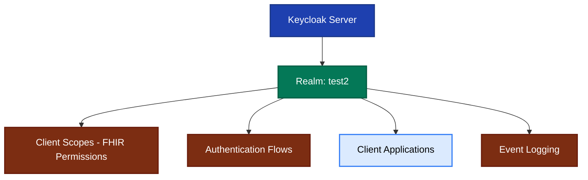

# Keycloak Configuration for FHIR - Overview

## Purpose

This documentation explains the Keycloak configuration file used to set up an OAuth 2.0/OpenID Connect authorization server for healthcare applications using the FHIR standard. The configuration implements the **SMART App Launch Framework**, which is the healthcare industry standard for secure application authorization.

## Target Audience

- Healthcare application developers
- DevOps engineers setting up FHIR authentication
- Security architects implementing SMART on FHIR
- QA engineers testing FHIR application authorization

## Configuration File Location

```text
keycloak-config/src/test/resources/keycloak-config.json
```

## High-Level Architecture



**Figure 1:** Top-level configuration structure showing the main components of the Keycloak setup.

## Key Concepts

### Realm

An isolated configuration space in Keycloak - similar to a tenant or workspace. All authentication, authorization, and user management settings are scoped to a realm.

### Client Scopes

Define what permissions applications can request and what claims are included in tokens. In FHIR context, these represent access to specific healthcare resource types.

### Client

An application that uses Keycloak for authentication. In this configuration, the `inferno` client represents a FHIR testing tool.

### Authentication Flow

The sequence of steps a user goes through during login. This configuration implements SMART App Launch with patient selection.

### Protocol Mappers

Components that inject data into tokens - such as patient IDs, user resource IDs, and audience claims.

## Related Documentation

- [Configuration Structure Details](./keycloak-config-structure.md)
- [Authentication Flow](./keycloak-auth-flow.md)
- [Client Scopes and Permissions](./keycloak-scopes.md)
- [SMART App Launch Implementation](./smart-app-launch.md)

## Quick Reference

| Component     | Purpose                | Key Feature                  |
| ------------- | ---------------------- | ---------------------------- |
| Server Config | Connection details     | Admin credentials and URL    |
| Realm         | Isolated environment   | Contains all settings        |
| Client Scopes | Permission definitions | FHIR resource access levels  |
| Clients       | Applications           | OAuth 2.0 client settings    |
| Auth Flows    | Login process          | SMART with patient selection |
| Events        | Audit logging          | Security compliance tracking |

## Next Steps

1. Review the [Configuration Structure](./keycloak-config-structure.md) for detailed component breakdown
2. Understand the [Authentication Flow](./keycloak-auth-flow.md) for SMART App Launch
3. Explore [Client Scopes](./keycloak-scopes.md) for FHIR permissions model
