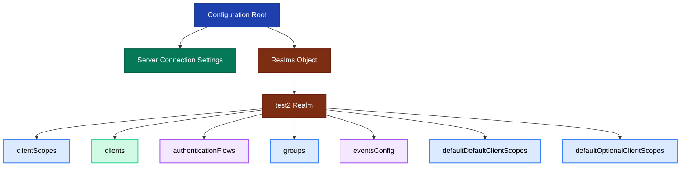

# Keycloak Configuration Structure

## Overview

This document details the complete structure of the Keycloak configuration JSON file, explaining each section and its purpose in the SMART on FHIR authentication system.

## Configuration Hierarchy



**Figure 1:** Complete configuration hierarchy showing all major components and their relationships.

## Server Connection Settings

Located at the root `keycloak` object level.

### Properties

| Property | Type | Purpose | Example |
|----------|------|---------|---------|
| `serverUrl` | String | Keycloak server base URL | `http://localhost:55095/auth` |
| `adminUser` | String | Administrator username | `admin` |
| `adminPassword` | String | Administrator password | `admin` |
| `adminClientId` | String | Admin CLI client identifier | `admin-cli` |

### Usage

These credentials are used by the `KeycloakConfigurator` tool to connect to the Keycloak server and apply the configuration programmatically.

```json
{
  "keycloak": {
    "serverUrl": "http://localhost:55095/auth",
    "adminUser": "admin",
    "adminPassword": "admin",
    "adminClientId": "admin-cli",
    "realms": { ... }
  }
}
```

## Realm Configuration

### Realm Properties

```json
{
  "test2": {
    "enabled": true,
    "clientScopes": { ... },
    "clients": { ... },
    "authenticationFlows": { ... },
    "browserFlow": "SMART App Launch",
    "groups": { ... },
    "defaultGroups": ["fhirUser"],
    "eventsConfig": { ... },
    "defaultDefaultClientScopes": [ ... ],
    "defaultOptionalClientScopes": [ ... ]
  }
}
```

### Key Settings

- **`enabled`**: Boolean flag to activate/deactivate the realm
- **`browserFlow`**: Name of the authentication flow for browser-based logins
- **`defaultGroups`**: Groups automatically assigned to all new users

## Client Scopes Section

Client scopes define OAuth 2.0 scopes and the claims they add to tokens. See [Client Scopes and Permissions](./keycloak-scopes.md) for detailed information.

### Structure

Each client scope contains:

```json
{
  "scopeName": {
    "protocol": "openid-connect",
    "description": "Human-readable description",
    "attributes": {
      "consent.screen.text": "Text shown on consent screen",
      "display.on.consent.screen": "true/false"
    },
    "mappers": {
      "mapperName": {
        "protocol": "openid-connect",
        "protocolmapper": "mapper-type-identifier",
        "config": { ... }
      }
    }
  }
}
```

### Categories of Scopes

1. **Core SMART Scopes**: `fhirUser`, `launch/patient`, `online_access`
2. **Wildcard Scope**: `patient/*.read`
3. **Granular Resource Scopes**: 25+ individual FHIR resource types

## Clients Section

Defines applications that can authenticate through Keycloak.

### Client Configuration Structure

```json
{
  "inferno": {
    "consentRequired": true,
    "publicClient": true,
    "bearerOnly": false,
    "enableDirectAccess": false,
    "rootURL": "http://localhost:4567/inferno",
    "redirectURIs": [
      "http://localhost:4567/inferno/*",
      "http://localhost:4567/inferno2/*"
    ],
    "adminURL": "http://localhost:4567/inferno",
    "webOrigins": ["http://localhost:4567"],
    "defaultClientScopes": ["launch/patient"],
    "optionalClientScopes": [ ... ]
  }
}
```

### Client Properties Explained

| Property | Value | Meaning |
|----------|-------|---------|
| `consentRequired` | `true` | User must explicitly consent to requested scopes |
| `publicClient` | `true` | No client secret required - for browser/mobile apps |
| `bearerOnly` | `false` | Can initiate login flows - not just validate tokens |
| `enableDirectAccess` | `false` | Password grant disabled - forces proper OAuth flow |
| `redirectURIs` | Array | Allowed redirect URLs after authentication |
| `webOrigins` | Array | Allowed CORS origins for JavaScript clients |
| `defaultClientScopes` | Array | Scopes automatically included in requests |
| `optionalClientScopes` | Array | Scopes user can choose to grant |

## Authentication Flows Section

Defines custom authentication sequences. See [Authentication Flow](./keycloak-auth-flow.md) for detailed flow documentation.

### Flow Structure

```json
{
  "SMART App Launch": {
    "description": "browser based authentication",
    "providerId": "basic-flow",
    "builtIn": false,
    "authenticationExecutions": {
      "SMART Login": {
        "requirement": "ALTERNATIVE",
        "userSetupAllowed": false,
        "authenticatorFlow": true,
        "description": "Username, password, otp and other auth forms.",
        "providerId": "basic-flow",
        "authenticationExecutions": { ... }
      }
    }
  }
}
```

### Execution Properties

- **`requirement`**: `REQUIRED`, `ALTERNATIVE`, `DISABLED`, `CONDITIONAL`
- **`priority`**: Integer determining execution order
- **`authenticatorFlow`**: Boolean - true if this is a sub-flow
- **`authenticator`**: Identifier of the authenticator component
- **`configAlias`**: Name for this authenticator's configuration
- **`config`**: Key-value pairs for authenticator settings

## Groups Section

Defines user groups for role-based access control.

```json
{
  "groups": {
    "fhirUser": {}
  },
  "defaultGroups": ["fhirUser"]
}
```

All users are automatically added to the `fhirUser` group, which can be used in protocol mappers to add group claims to tokens.

## Events Configuration

Enables audit logging for security and compliance.

```json
{
  "eventsConfig": {
    "saveLoginEvents": true,
    "expiration": 23328000,
    "types": [
      "LOGIN", "LOGOUT", "CODE_TO_TOKEN", "REFRESH_TOKEN",
      "LOGIN_ERROR", "LOGOUT_ERROR", ...
    ],
    "saveAdminEvents": true
  }
}
```

### Events Configuration Properties

- **`saveLoginEvents`**: Enable user event logging
- **`expiration`**: Event retention period in seconds (270 days)
- **`types`**: Array of event types to log
- **`saveAdminEvents`**: Enable administrative action logging

### Event Types Tracked

- Authentication events: `LOGIN`, `LOGOUT`, `CODE_TO_TOKEN`
- Errors: `LOGIN_ERROR`, `LOGOUT_ERROR`, `CODE_TO_TOKEN_ERROR`
- Identity provider events: `FEDERATED_IDENTITY_LINK`, `IDENTITY_PROVIDER_FIRST_LOGIN`
- Token events: `REFRESH_TOKEN`, `REFRESH_TOKEN_ERROR`

## Default and Optional Client Scopes

These arrays define realm-wide defaults for all clients.

### Default Client Scopes

```json
{
  "defaultDefaultClientScopes": ["launch/patient"]
}
```

Scopes automatically included for all clients unless overridden.

### Optional Client Scopes

```json
{
  "defaultOptionalClientScopes": [
    "fhirUser",
    "offline_access",
    "online_access",
    "profile",
    "patient/*.read",
    "patient/AllergyIntolerance.read",
    ...
  ]
}
```

Scopes that clients can request but users must explicitly consent to.

## Configuration File Size and Complexity

- **Total Client Scopes**: 29 (4 core + 1 wildcard + 24 resource-specific)
- **Total Protocol Mappers**: 75+ (3-4 per scope)
- **Authentication Executions**: 3 in SMART flow
- **Tracked Event Types**: 16

This configuration provides comprehensive FHIR authorization capabilities while maintaining security best practices.

## Next Steps

- [Understanding Client Scopes](./keycloak-scopes.md)
- [Authentication Flow Details](./keycloak-auth-flow.md)
- [SMART App Launch Implementation](./smart-app-launch.md)
