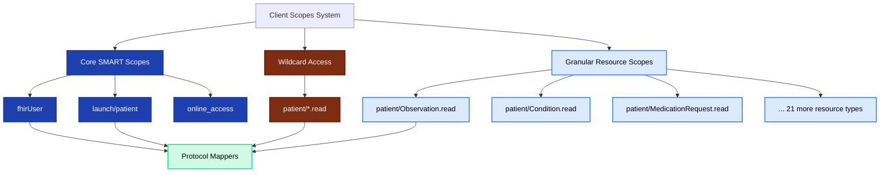
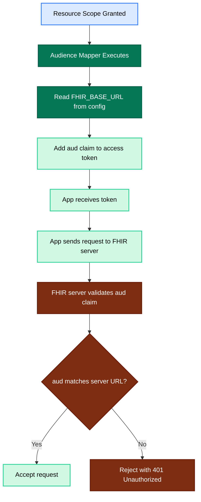
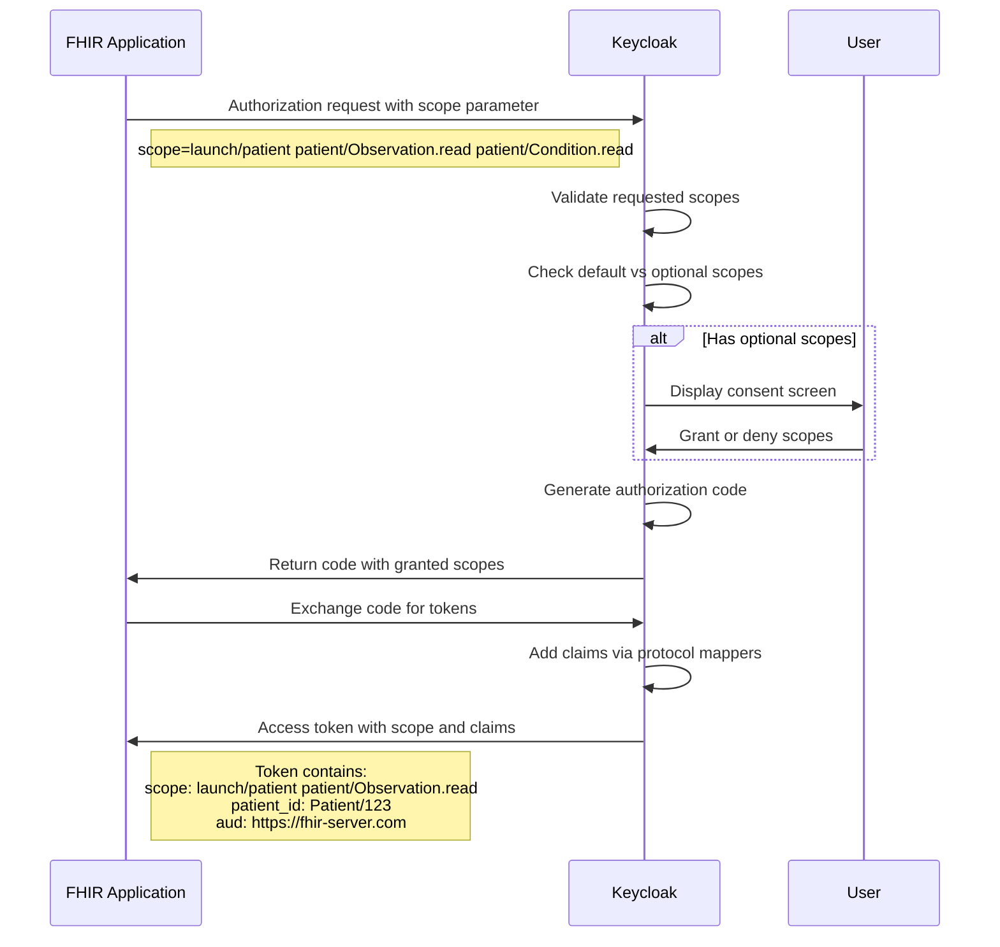
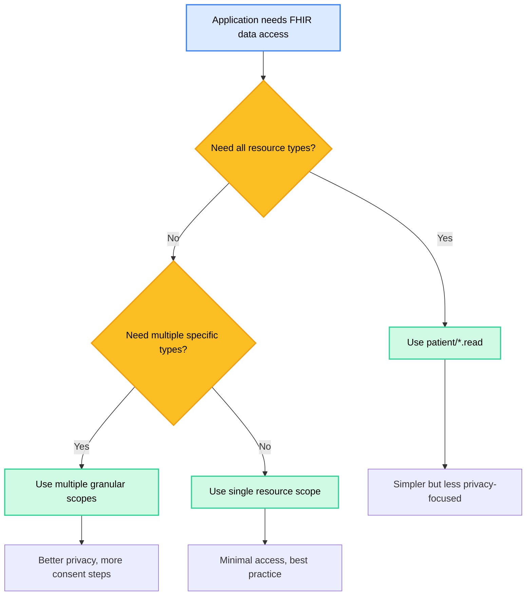

# Client Scopes and FHIR Permissions

## Overview

Client scopes define the OAuth 2.0 scopes that applications can request and determine what claims are added to tokens. In the FHIR context, scopes represent permissions to access specific types of healthcare data.

## Scope Architecture



**Figure 1:** Client scope hierarchy showing core, wildcard, and granular resource scopes.

## Core SMART Scopes

### fhirUser Scope

**Purpose**: Retrieve the current logged-in user's FHIR resource identifier.

```json
{
  "fhirUser": {
    "protocol": "openid-connect",
    "description": "Permission to retrieve current logged-in user",
    "attributes": {
      "consent.screen.text": "Permission to retrieve current logged-in user"
    },
    "mappers": {
      "fhirUser Mapper": {
        "protocol": "openid-connect",
        "protocolmapper": "oidc-patient-prefix-usermodel-attribute-mapper",
        "config": {
          "user.attribute": "resourceId",
          "claim.name": "fhirUser",
          "jsonType.label": "String",
          "id.token.claim": "true",
          "access.token.claim": "false",
          "userinfo.token.claim": "true"
        }
      }
    }
  }
}
```

**Key Features**:

- Adds `fhirUser` claim to ID token and UserInfo endpoint
- Format: `Patient/{id}` or `Practitioner/{id}` depending on user type
- Uses custom mapper: `oidc-patient-prefix-usermodel-attribute-mapper`
- Reads from user attribute: `resourceId`

**Token Claim Example**:

```json
{
  "fhirUser": "Patient/123"
}
```

### launch/patient Scope

**Purpose**: Enables patient context during authorization, allowing the app to request patient-specific data.

```json
{
  "launch/patient": {
    "protocol": "openid-connect",
    "description": "Used by clients to request patient scope",
    "attributes": {
      "display.on.consent.screen": "false"
    },
    "mappers": {
      "Patient ID Mapper": { ... },
      "Group Membership Mapper": { ... }
    }
  }
}
```

**Key Features**:

- Required for SMART App Launch with patient context
- Does not display on consent screen (system-level scope)
- Includes two critical mappers

#### Patient ID Mapper

```json
{
  "Patient ID Mapper": {
    "protocol": "openid-connect",
    "protocolmapper": "oidc-usermodel-attribute-mapper",
    "config": {
      "user.attribute": "resourceId",
      "jsonType.label": "String",
      "claim.name": "patient_id",
      "id.token.claim": "false",
      "access.token.claim": "true",
      "userinfo.token.claim": "false"
    }
  }
}
```

- Adds `patient_id` claim to access token only
- Used by FHIR server to filter data to specific patient
- Format: `Patient/{id}` (extracted from `resourceId` user attribute)

#### Group Membership Mapper

```json
{
  "Group Membership Mapper": {
    "protocol": "openid-connect",
    "protocolmapper": "oidc-group-membership-mapper",
    "config": {
      "claim.name": "group",
      "full.path": "false",
      "id.token.claim": "true",
      "access.token.claim": "true",
      "userinfo.token.claim": "true"
    }
  }
}
```

- Adds user's group memberships to all tokens
- Used for role-based access control
- Format: Array of group names

### online_access Scope

**Purpose**: Request a refresh token that remains valid while the user is online.

```json
{
  "online_access": {
    "protocol": "openid-connect",
    "description": "Request a refresh_token that can be used to obtain a new access token to replace an expired one, and that will be usable for as long as the end-user remains online.",
    "attributes": {
      "consent.screen.text": "Retain access while you are online"
    }
  }
}
```

**Key Features**:

- Part of SMART on FHIR specification
- Refresh token invalidated when user logs out
- Requires user consent
- No protocol mappers (affects token lifetime only)

## Wildcard Scope

### patient/*.read

**Purpose**: Grant read access to all patient-compartment resources.

```json
{
  "patient/*.read": {
    "protocol": "openid-connect",
    "description": "Read access to all data",
    "attributes": {
      "consent.screen.text": "Read access to all data for the patient"
    },
    "mappers": {
      "Audience Mapper": {
        "protocol": "openid-connect",
        "protocolmapper": "oidc-audience-mapper",
        "config": {
          "included.custom.audience": "<FHIR_BASE_URL>",
          "access.token.claim": "true"
        }
      }
    }
  }
}
```

**Key Features**:

- Single scope grants access to all FHIR resources
- More convenient but less granular than individual resource scopes
- Includes audience mapper for FHIR server validation
- Requires user consent

**Use Case**: Applications that need comprehensive patient data access.

## Granular Resource Scopes

Each FHIR resource type has its own scope for fine-grained permissions.

### Scope Pattern

All resource scopes follow this pattern:

```json
{
  "patient/{ResourceType}.read": {
    "protocol": "openid-connect",
    "description": "Read access to {ResourceType}",
    "attributes": {
      "consent.screen.text": "Read access to {ResourceType} for the patient"
    },
    "mappers": {
      "Audience Mapper": {
        "protocol": "openid-connect",
        "protocolmapper": "oidc-audience-mapper",
        "config": {
          "included.custom.audience": "<FHIR_BASE_URL>",
          "access.token.claim": "true"
        }
      }
    }
  }
}
```

### Complete Resource Scope List

| Category | Resource Scopes |
|----------|----------------|
| **Allergies & Conditions** | `patient/AllergyIntolerance.read`, `patient/Condition.read` |
| **Medications** | `patient/Medication.read`, `patient/MedicationRequest.read` |
| **Care Plans** | `patient/CarePlan.read`, `patient/CareTeam.read`, `patient/Goal.read` |
| **Clinical Data** | `patient/Observation.read`, `patient/DiagnosticReport.read`, `patient/Procedure.read` |
| **Encounters** | `patient/Encounter.read`, `patient/Location.read` |
| **Documents** | `patient/DocumentReference.read`, `patient/Provenance.read` |
| **Patient Info** | `patient/Patient.read`, `patient/RelatedPerson.read` |
| **Care Providers** | `patient/Practitioner.read`, `patient/PractitionerRole.read`, `patient/Organization.read` |
| **Devices** | `patient/Device.read` |
| **Immunizations** | `patient/Immunization.read` |
| **Financial** | `patient/ExplanationOfBenefit.read` |

**Total**: 25 granular resource scopes defined.

### Audience Mapper

Every resource scope includes an audience mapper to ensure tokens are only valid for the intended FHIR server.



**Figure 2:** Audience claim flow from scope to FHIR server validation.

## Scope Assignment to Clients

### Default Client Scopes

Scopes automatically included for all clients:

```json
{
  "defaultDefaultClientScopes": ["launch/patient"]
}
```

- Always included in authorization requests
- No user consent required
- Essential for SMART App Launch

### Optional Client Scopes

Scopes that clients can request but require user consent:

```json
{
  "defaultOptionalClientScopes": [
    "fhirUser",
    "offline_access",
    "online_access",
    "profile",
    "patient/*.read",
    "patient/AllergyIntolerance.read",
    "patient/CarePlan.read",
    ...
  ]
}
```

### Client-Specific Configuration

The `inferno` client overrides realm defaults:

```json
{
  "inferno": {
    "defaultClientScopes": ["launch/patient"],
    "optionalClientScopes": [
      "fhirUser",
      "offline_access",
      "online_access",
      "profile",
      "patient/*.read",
      "patient/AllergyIntolerance.read",
      ...
    ]
  }
}
```

## Scope Request Flow



**Figure 3:** Scope request and token generation sequence.

## Token Claim Mapping Summary

| Scope | Mapper | Claim Name | Token Type | Source |
|-------|--------|------------|------------|--------|
| `fhirUser` | fhirUser Mapper | `fhirUser` | ID Token, UserInfo | User attribute `resourceId` |
| `launch/patient` | Patient ID Mapper | `patient_id` | Access Token | User attribute `resourceId` |
| `launch/patient` | Group Membership Mapper | `group` | All tokens | User groups |
| All resource scopes | Audience Mapper | `aud` | Access Token | Scope config `included.custom.audience` |

## Best Practices

### Scope Selection



**Figure 4:** Decision tree for selecting appropriate scopes.

### Recommendations

1. **Request Minimum Necessary Scopes**: Only request access to data actually needed
2. **Use Granular Scopes When Possible**: Better for privacy and user trust
3. **Always Include `launch/patient`**: Required for patient context
4. **Consider User Experience**: Too many consent prompts can hurt UX
5. **Document Scope Usage**: Explain why each scope is needed

## Custom Scope Development

To add new custom scopes:

1. Define scope in configuration JSON
2. Add protocol mapper configuration
3. Implement custom mapper if needed (Java)
4. Register in `META-INF/services/org.keycloak.protocol.ProtocolMapper`
5. Add to default or optional client scopes lists

## Related Documentation

- [Authentication Flow](./keycloak-auth-flow.md)
- [Token Claims and Mappers](./keycloak-token-mappers.md)
- [SMART on FHIR Specification](http://hl7.org/fhir/smart-app-launch/)
